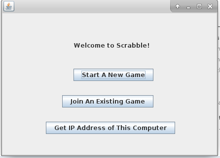
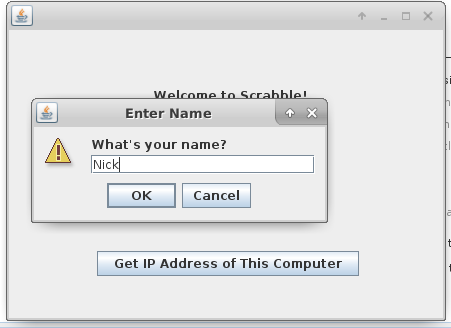
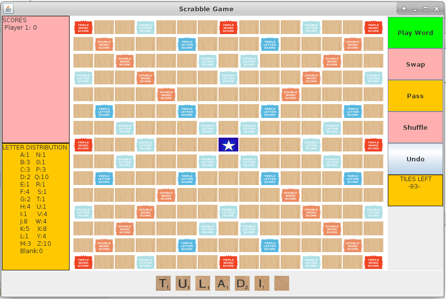
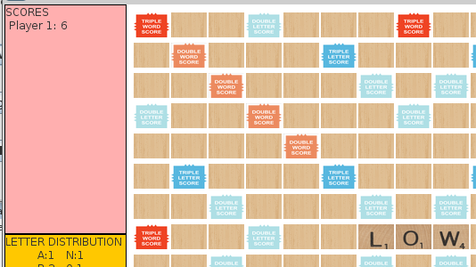
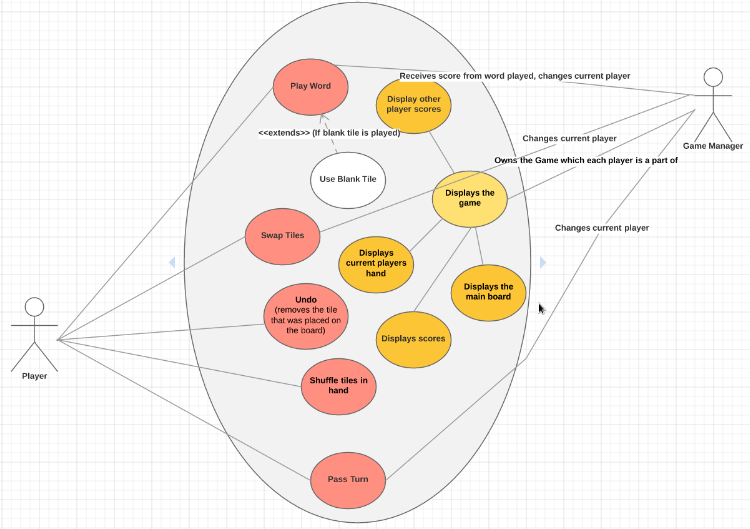

# Scrabble (in Java)

---
Play a Scrabble-like game on your machine, built in Java!

_Team Name: The Scraballers
Team Members: Nick Simons, Jenna Slusar, Caroline Whitman_

---

### Motivation

We, the Scraballer Team, chose to implement a Scrabble-like word game to exercise and exemplify our understanding of software design principles -- particularly MVC architecture.

---

### Usage

To begin the game, **Run StartBoxMain.java** after you have cloned or downloaded this repository.  The window below will appear.

To play, click **Start A New Game**, then choose "1" for the number of players.  ***Note:*** **Currently, you _must_ select these specific options.  Other game modes are not yet fully supported**

A window will appear, prompting you to enter your name.  You may choose to enter someone else's name, if you wish, but we're not sure why you'd want to do that.  Click **OK** once you have input the name of your choice.

When you have entered your name, a Scrabble board much like the one shown below will appear.  Let's explore the different parts of the board.

* At the center of the window is the Scrabble board itself.
* Below the board is your hand of tiles.  To play a tile:
    * Click the chosen tile in your hand (the tile will disappear for now, but don't fret!)
    * Click the square on the board in which you wish to place your tile.  Your tile will now reappear on that square.
* On the right side of the window, the _top-most_ button is the **Play Word** button.  After you have placed all tiles for a given word, click this button to rack up your score.
    * If you misplace a tile, you may click the **Undo** button, the bottom button on the right side of the window.  This returns the most recently placed tile to your hand.
    * If you meant to place a different tile on a given square, click the **Swap** button directly below the **Play Word** button.  Enter the tiles that you wish to swap in the appropriate text fields.
* You may click the **Shuffle** button to reorder the tiles in your hand.  This is useful if you get stuck and need a new perspective.
* Once you have finished your turn by playing a word, click the **Pass** button.  In a one-player game, this will refill your hand.

There are a few other helpful areas in this window.
* At the bottom right, you will see a count of the remaining tiles.
* At the bottom left, you will see a handy key for reminding you how many copies of each tile exist
* Finally, at the top right, you will see your current score.

Below is an example of the board and scoreboard after one word is played:

---

### Player/Game Manager Structure

Above is a graphic displaying the roles of a Player and the Game Manager object, as well as the ways in which each interacts with the Game.

---

### Future Directions

* Enable multiplayer mode on a single machine
* Allow networking to enable multiplayer games across machines

## Credits

Special thanks to:
* Professor Brian King in the Bucknell University Department of Computer Science
* Hasbro, the original developers of this board game!
